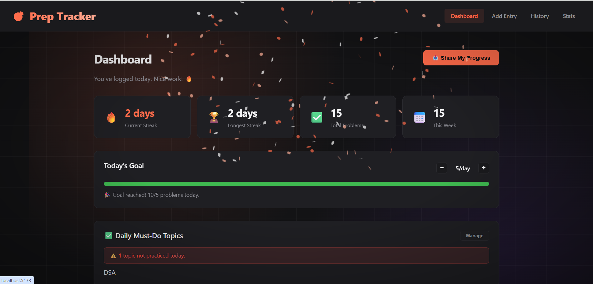
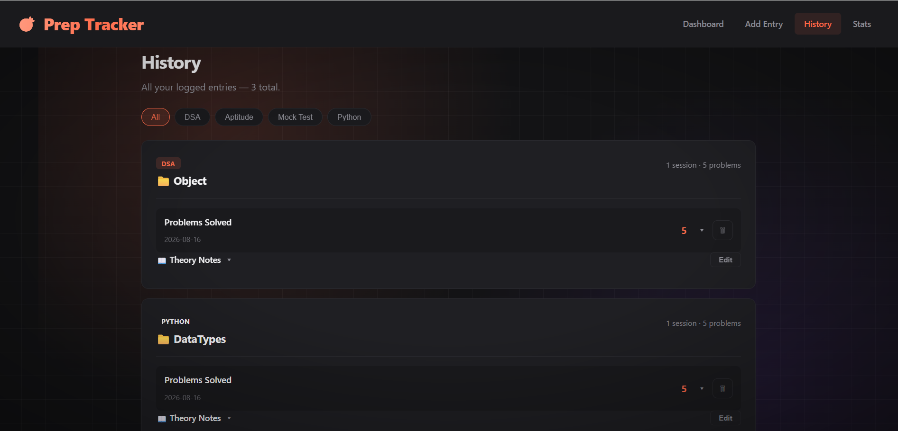
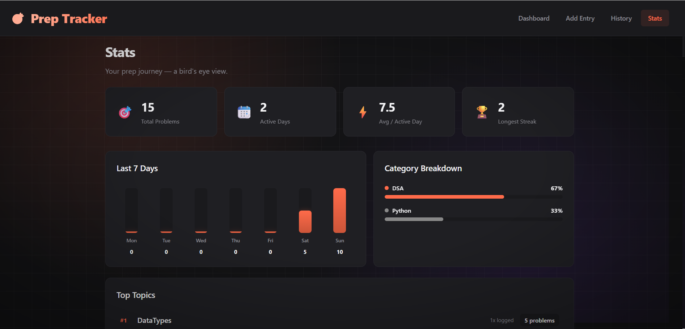

# 🎯 Daily Placement Prep Tracker
🚀 [Live Demo](https://prep-tracker-frontend-33hd.onrender.com)

A full-stack personal productivity tool that helps track daily placement preparation — DSA problems, aptitude, mock tests, and core subjects — with a GitHub-style streak calendar, daily goals, and pace prediction against a placement date.

Built because generic to-do apps didn't fit how I actually prepare: I needed to track *which specific problems* I solved under each topic (with code/notes), see if I was staying consistent, and know whether I was on pace to hit my target before placements.

---

## ✨ Features

- **Streak Calendar** — GitHub-style contribution heatmap showing daily activity
- **Daily Goal Tracker** — set a daily problem-solving target with a live progress bar and confetti celebration on completion
- **Topic-wise History** — entries grouped by topic, each expandable to show the exact problems solved (with code) for that session
- **Theory Notes** — persistent, editable concept notes per topic for quick revision
- **Placement Countdown & Pace Predictor** — set a placement date and problem target; the app calculates your required daily pace vs. your actual pace and flags whether you're on track
- **Daily Must-Do Topics** — mark core subjects that must be touched every day, with an alert if missed
- **Shareable Progress Card** — exports your streak/stats as a downloadable PNG image (built with the Canvas API)
- **Stats Dashboard** — weekly activity chart, category breakdown, and top topics
- **Dynamic Categories** — starts with a small base list; custom categories you type are remembered for next time
- **Dark theme UI** with custom animations (fade-ins, hover effects, animated backgrounds)

---

## 🛠 Tech Stack

**Backend**
- Python, FastAPI
- SQLite + SQLAlchemy ORM
- REST API with a custom streak-calculation algorithm (date-walking logic for current/longest streak)

**Frontend**
- React + Vite
- React Router (multi-page navigation)
- Recharts (weekly activity chart)
- Canvas API (shareable progress image export)
- Plain CSS (custom dark theme, no framework)

---

## 📂 Project Structure

```
prep-tracker/
├── prep-tracker-backend/
│   ├── app/
│   │   ├── main.py          # FastAPI app entry, CORS setup
│   │   ├── database.py      # SQLite connection (SQLAlchemy)
│   │   ├── models.py        # Entry table schema
│   │   ├── schemas.py       # Pydantic request/response validation
│   │   ├── routers/
│   │   │   └── entries.py   # CRUD + stats endpoints
│   │   └── utils/
│   │       └── streak.py    # Streak calculation logic
│   └── requirements.txt
│
└── prep-tracker-frontend/
    ├── src/
    │   ├── api/client.js        # Backend API wrapper
    │   ├── pages/
    │   │   ├── Dashboard.jsx    # Streak calendar, goals, countdown
    │   │   ├── AddEntry.jsx     # Log form
    │   │   ├── History.jsx      # Topic-grouped entries + theory notes
    │   │   └── Stats.jsx        # Charts and breakdowns
    │   ├── components/
    │   │   ├── StreakCalendar.jsx
    │   │   ├── StatCard.jsx
    │   │   └── ShareCard.jsx
    │   ├── App.jsx
    │   └── style.css
    └── package.json
```

---

## 🚀 Running Locally

### Backend
```bash
cd prep-tracker-backend
pip install -r requirements.txt
python -m uvicorn app.main:app --reload
```
Runs at `http://localhost:8000` (API docs at `/docs`)

### Frontend
```bash
cd prep-tracker-frontend
npm install
npm run dev
```
Runs at `http://localhost:5173`

> Both servers need to run simultaneously — the frontend calls the backend API.

---

## 🧠 Notable Implementation Detail: Streak Calculation

The core logic walks backward from today through a sorted, deduplicated set of logged dates, incrementing a counter until it hits a gap — giving the *current* streak. For the *longest* streak, it does a single forward pass tracking the longest run of consecutive calendar days. Both run in O(n log n) due to the sort, O(n) otherwise.

---

## 📌 Notes

This is a single-user, local-first tool by design — no login/auth, since it's meant to be run by one person tracking their own prep. Data persists in a local SQLite file.

---

## 📸 Screenshots

### Dashboard


### History


### Stats


---

Built by Kalaiselvi G while preparing for placements.
